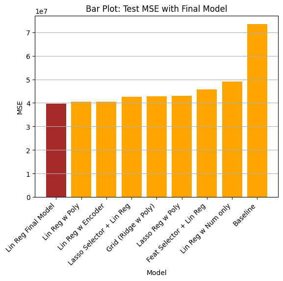

This repo contains the code for Practical Application Assignment 11.1
By Vincent Mui

## Project: What factors make a car more or less expensive
Link to [the notebook] https://github.com/vincentmui/Assignment11.1/blob/main/assignment-11.1-vincent.ipynb 

## Business Goal
To understand what factors make a car more or less expensive. To provide clear recommendations to a used car dealership -- as to what consumers value in a used car.

Tools

- `Python` and `pandas` were used to create statistical summaries
- `Matplotlib` and `Seaborn` libraries were utilized to create visualizations
- `scikit-learn` libraries for regression models (Linear regression, Ridge, Lasso), data pre-processing + encoding + transformation, structured pipeline, Grid Search CV, Feature Selector, metrics, train/test data set split, etc.

CRISP-DM framework was applied to this data project

## Business Understanding

Business Task:
- To identify key drivers for used car prices.

Data Tasks:
- Which factors or variables (color, condition, odometer reading, etc.) are the best predictors of the outcome variable (car price)?
- How much do these independent variable(s) influence the outcome variable (car price)?
- Can we use an algorithm to model the data to determine the magnitude and sign of such influences?

## Data Understanding

Here are the column descriptions for business data understanding, after performaning Exploratory Data Analysis (EDA) on our source dataset:

Total 42,6880 data rows, 18 data columns:
```
  #   Column    Missing Values   Type    Description 
 ---  ------    --------------   -----   ---------------------------------
  0   id                   0     Number  Unique identifier
  1   region               0     String  Craigslist region e.g., florida keys
  2   price                0     Number  Used car price
  3   year             1,205     Number  Manufacture year of vehicle
  4   manufacturer    17,646     String  e.g., ford, audi
  5   model            5,277     String  e.g., f-150, tacoma
  6   condition      174,104     String  Condition of vehicle e.g., good, like new
  7   cylinders      177,678     String  Engine: no. of cylinders e.g., 6 cylinders
  8   fuel             3,013     String  Fuel type e.g., gas, diesel, hybrid, electric  
  9   odometer         4,400     Number  Miles traveled by vehicle
  10  title_status     8,242     String  Title status e.g., clean, lien
  11  transmission     2,556     String  Transmission type e.g., automatic, manual
  12  VIN            161,042     String  Unique Vehicle Identification Number
  13  drive          130,567     String  Type of drive e.g., 4wd, rwd, fwd
  14  size           306,361     String  Size of vehicle e.g., full-size
  15  type            92,858     String  Type of vehicle e.g., sedan
  16  paint_color    130,203     String  Color of vehicle paint e.g., white
  17  state                0     String  State of listing e.g., ca, fl
```
## Data Preparation

Steps to construct a final dataset prior to modeling:

Data Cleaning
- Drop Columns with useless data and too much missing values: `id`, `VIN`, `region`, `state`, `model`, `size`
- Drop Rows for data columns with fewer missing values
- Drop Values that are "others" or "custom", because these values may not help business on prediction.

Feature Engineering
- Derive a new column `age` from the `year` values, using 2020 dataset creation year as base year. e.g., age = 2020 - car year
- Transform `cylinders` value labels to integers Encoding

Encoding
- Apply ordinal to `condition`
- Apply OneHotEncoder to remaining categorical columns for regression models

Outliers
- Apply Interquartile range (IQR = 𝑄3 − 𝑄1 ) to detect outliers for elimination
- Apply to numeric columns: `price`, `odometer`, `cylinder`, `age`

Scaling
- Data scaling will be performed during the Modeling step of CRSIP-DM framework

Cross-validation (will be performed during the Modeling step)

Train / Test Split: create a holdout "test set" for cross-validation to assess models' performance

## Modeling

Approach
- Apply various regression models: `Linear Regression`, `Ridge`, and `Lasso`
- Use various degrees of polynomials to determine best model fit
- Use Grid Search to select hyper-parameters (e.g, alpha, polynomial degrees) to determine best model fit
- Later use Sequential Feature Selector to pick top predictors in model(s)
- Use Pipeline to structure data processing and modeling steps
- Use a held-out test dataset for cross-validation
- Use Mean Squared Error (MSE) on test dataset to compare model performances
- Use results as feedback to see if further tuning during Data Preparation step is necessary

Notes: Mean Squared Error (MSE) is being used as evaluation metric due for the following reasons:
- MSE is widely used in applications like linear regression
- Intention is to penalize larger errors more heavily, so that we can more effectively differentiate between model performances

Models - 7 regression models were built with the price as the target:
```
  1	Linear Regression (numeric features only)
  2	Linear Regression (encode all features)  
  3	Linear Regression (best polynomial features)  
  4	Linear Regression (Sequential Feature Selector)  
  5	Ridge Regression (GridSearchCV with Ridge Regressor + Polynomial Features)  
  6	Lasso Regression + Polynomial Features  
  7	Lasso as Feature Selector + Linear Regression
```
After data cleaning, transformation, and feature engineering, we fit the cleaned data these 7 different models (plus one fine-tuned model). Here are the results:



## Evaluation

Using Mean Squared Error as our evaluation metrics, we found Linear Regression model with both numeric features and categorical features (encoded) performs the best. Then we went back and fine-tuned the regression model to select top predictive features and their weights.

Predicted car price = 
1,026 x number of cylinders) + (4,194 if manufacturer is Lexus) + (653 x age of car) - (0.04 x odometer reading) - (2,640 if type hatchback) - (3,358 if drive is front-wheel-drive)

Here is a business summary of our top predictive features (independent variables) for user car prices: 

Note: Model's intercept value (or baseline price before independent variables) = $20,328

- Top numeric variable for predicting car price: `cylinders` 
- Top categorical variable for predicting car price: `fuel` type is `"diesel"`

Features projected to make car prices more expensive:
- `Cylinders`: more engine cylinders = $1,026 price increase
- `Fuel`: diesel fuel type contributes to $6,652 price increase
- `Manufacturer`: Lexus and Toyota brands contributes to 2,436 price premium respectively

Features projected to make car prices less expensive:
- `Age`: Each year older translates to $653 off the car price
- `Odometer`: each 100 miles increase = $4 price decrease
- `Type`: cars with types "sedan", "hatchback" and "SUV" translate to at least $2k price decrease
- `Drive`: cars with "fwd" or front-wheel-drive translate to $3,357 price decrease

## Actionable Items - Recommendations to Client

As the data modeling shows consumers value Lexus and Toyota manufacturers more, we recommend car dealerships to stock up more cars from these two manufacturers for better sales. Diesel cars also fall into this category - they are selling at significantly higher prices. Dealerships should also try to showcase used car inventory of these two brands and diesel cars at visible areas of their showroom or car lot, to attract potential car buyers. Dealerships should do the same for used cars with more cylinders e.g., 6 or 8, because these used cars are selling at higher prices.

On the other hand, sedans, hatchbacks, SUV's, and front-wheel-drive cars in general do not hold values very well from consumers' perspective. Dealerships should try to avoid stocking up too many inventory in these categories.

It is logical to observe that older cars and higher mileage (odometer reading) have a negative impact on used cars. Therefore we recommend dealerships to set a threshold on car age and mileage when getting inventory, or sell existing inventory fast by providing consumers additional discounts, so that this inventory will move fast and not stay in inventory lot to continue to increase in "age".

## Next Steps

- Data source: We recommend dealerships to also gather "Fuel Economy" (for gasoline cars) and "Horsepower" data for data analysis and modeling, because these seem to be good predictors of car prices.
- Modeling: In the future down the course, we would add additional models (e.g., random forest). I feel "condition" could rank higher as a predictor with other models that may still beat the test MSEs of this exercise.
- Monitoring and Maintenance: In the future we shall continue to collect newer and recent data to feed into the models to identify changes in consumer preferences, and then adjust dealership car sales strategy accordingly

## Deployment
- This jupyter notebook can be run in Pyhton 3.14.3 or above envinment
- The \data subdirectory has the source data
- The \images subdirectory contain images and plots
